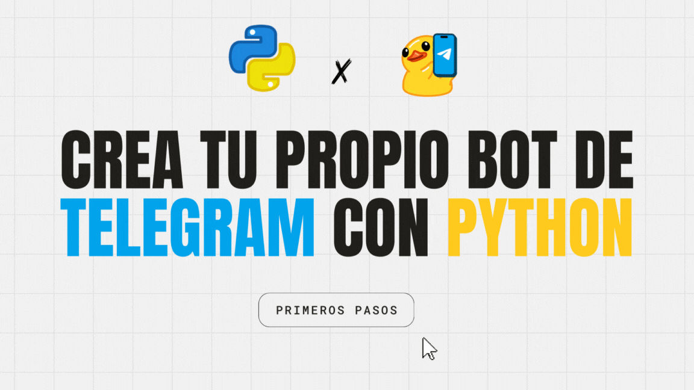

# Crea tu propio bot de Telegram con Python - Taller HolaMundoDay

¡Bienvenido! 👋🏼 Este repositorio contiene el código fuente de un sencillo bot de Telegram creado durante el taller "_**Crea tu propio bot de Telegram con Python**_"en la segunda edición del evento [HolaMundoDay](https://holamundo.day/) organizado por [@mouredev](https://github.com/mouredev).

Este ejemplo demuestra cómo crear un bot de Telegram utilizando el lenguaje de programación Python y la librería `telebot`. El bot implementado en este ejemplo ofrece funcionalidades básicas, como saludar a los usuarios, contar palabras y contar caracteres en mensajes de texto. 

> **_LINKS IMPORTANTES:_** 
>[Documentación de la API de Telegram Bot](https://core.telegram.org/bots) 
>[Documentación telebot](https://github.com/eternnoir/pyTelegramBotAPI)

### Requisitos

Para ejecutar el bot localmente, necesitas lo siguiente:

- Python instalado en tu sistema
- Un bot token de Telegram obtenido del BotFather en Telegram
- La librería `telebot` instalada (`pip install pyTelegramBotAPI`)

> **_NOTA:_** 
> Sustituye "TELEGRAM_TOKEN" en el código del bot por tu token bot real.